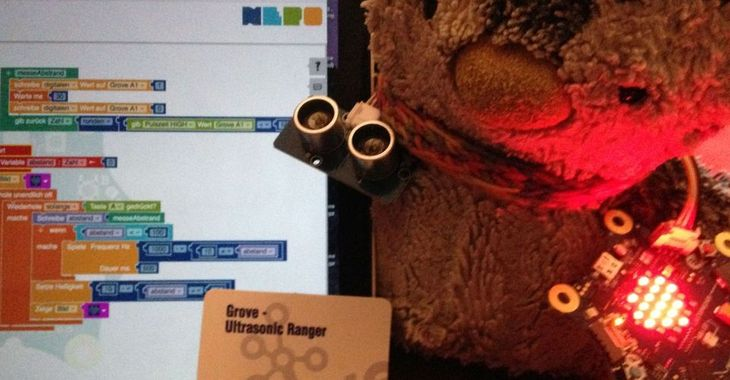

# Calliope

Calliope ist ein Mini-Computer ähnlich zu Arduino aber für den Schuluntericht entwickelt, es soll in den nächsten Jahren an alle Schulen ausgeliefert werden.

Wir haben zwei Klassensätze (a 25) Calliope am BeBe diese wurden aus Spenden finanziert.

## Erste Schritte

- Allen sollten in Paaren **zusammen sitzen**, dann können jeder sich gegenseitig helfen und bleiben nicht so schnell hängen.
- Herumgehen und bei Probleme gleich helfen (Erinnern sich zu melden wenn jemand nicht weiterkommt)

- Calliope auspacken, Batteriefach ansteckend und anschalten.
- Dann die vorinstallierten Programme und Spiele vom kleinen Beipackheftchen ausprobieren lassen (das Menü ist manchmal etwas tricky).

- Dann geht es los mit [Erste Schritte](erste-schritte.md) (LED, Laufschrift, LED-Feld)
- Es macht Spass zum Schluss der Stunde einen Kreativblock zu lassen (10-15min) und dann eine "Demorunde" zu machen, dann kann jede Gruppe zeigen was sie noch gezaubert haben.

## Links

* https://calliope.cc/
* [Editoren](https://calliope.cc/los-geht-s/editor) MakeCode ist gut, OpenRoberta ähnlich
* [Projekte](https://www.hackster.io/calliope-mini)

## Was haben wir gemacht?

* Tasten
* Laufschrift
* RGB-LED Farbwechsel
* [Disco-LED](disco.md) (Random x,y,helligkeit) 
* Lärmampel
* Fledermaus Abstandsmesser (mit Groove Sensor), dann mit verbundenen Augen durchs Schulhaus
* Smileys senden über Bluetooth Verbindung, Smiley aus liste auswählen und senden
* Würfel mit Würfel-Anzeige
* Spiel mit Remote-Würfel und zentralem Spiel in der Mitte
* Zahlen-Rate-Spiel (Zufallszahl wird per Klick verringert, Weitergeben, wer auf 0 kommt hat verloren)
* Timer Countdown mit Aktion (Song, Lichter, Töne) bei Ablauf und Einstellen der Zeit
* Neopixel (Mit MakeCode, NeoPixel Erweiterung)
* Musik (mit Noten) - *benötigt Lautsprecher sonst klingt es schlecht und die Kids sind frustriert*
* Weihnachtsbaumschmuck (Laufschrift, Lichter, Lichterkette, Musik) Calliopes mit verschiedenen Programmen als Baumanhänger.
* LED-Punkt bewegen mittels Neigungssensor (Malprogramm, unsichtbaren Zufallspunkt finden)
* Dämmerungssensor, Temperaturmesser

## Tips

Wichtig:

- Anmeldung (z.b. bei OpenRoberta) nicht vergesssen
- Regelmässig ans Speichern (Online) erinnern
- MakeCode speichert im Browser, daher in Schulumgebungen schwierig
- Die heruntergeladenen Binärdateien (.hex) können nur mit "MakeCode" wieder in den Editor geladen werden
- In OpenRoberta muss man sie separat als XML "exportieren"

Am schwierigsten ist der Download der Dateien auf den Calliope, die Browser speichern das Program im Download Ordner.

Die Kinder mussten üben, diesen zu finden/öffnen, und das richtige Programm von da auf das "Mini"-Laufwerk zu ziehen.

Die Programme werden oft nicht überschrieben, daher:

- Auf die (1), (2), (3) Endungen achten
- Nach Zeit sortieren
- Manche Kinder geben ihren Programmen auch vor dem Download neue Namen

## Coole Ideen die wir ausprobieren wollen

* Messlatte: https://www.hackster.io/crismancich/calliope-mini-messlatte-a0ffa5
* einfacher Roboter: https://www.hackster.io/hansamann/simple-calliope-robot-c8aa85
* Messenger: https://www.hackster.io/hansamann/calliope-messenger-2c8f37
* Wasser-Sensor: https://www.hackster.io/hansamann/calliope-mini-water-level-sensor-759aa0
* Pulsmesser: https://www.hackster.io/hansamann/calliope-heart-rate-sensor-82cc92
* RC Ball Robot: https://www.hackster.io/moritz-heine/calliope-mini-rc-ball-car-423db4
* Schrittzähler: https://www.hackster.io/crismancich/calliope-mini-schrittzahler-cff398
* Calliope am iPad: https://www.hackster.io/luuc/calliope-an-ipad-11f427
* Optischer Näherungssensor: https://www.hackster.io/Weja/optischer-naherungssensor-fur-den-calliope-e8bf4e
