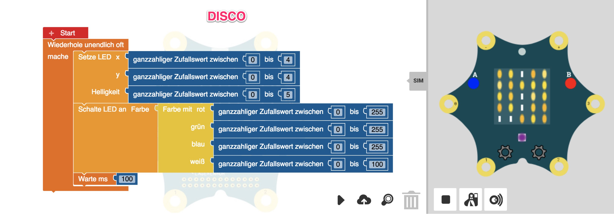

# Disco

Zufällig die LED's des 5x5 Feldes aufleuchten lassen.

Vorgehen:

- was ist ein Koordinatensystem
- wie kann ich jeden Punkt mit 0..4,0..4 ansprechen
- Ausprobieren, Setzen einzelner Punkte
- Wie kann man Punkte wieder Löschen? Mittels Helligkeit 0
- Helligkeit, Werte von 0..5
- Setzen mehrerer Punkte
- Erklärung Zufallszahlen
- Ausprobieren
- Endlosschleife drumherum
- Zu schnell -> Wartebefehl
- Sternenhimmel fertig
- Erklären Farbkomponenten (RGB) (Regenbogen)
- Setzen der LED Farbe mit zufälligen Farbwerten

FERTIG!!

Fortsetzung:

- Linien manuell zeichnen
- Erklärung Schleifen
- Linien mit Schleifen zeichnen

Folgeprojekte: Malprogramm, Snake
