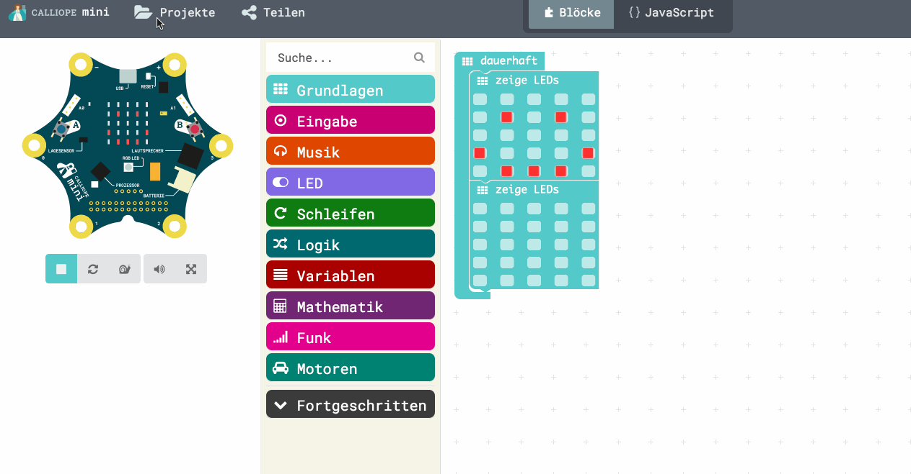
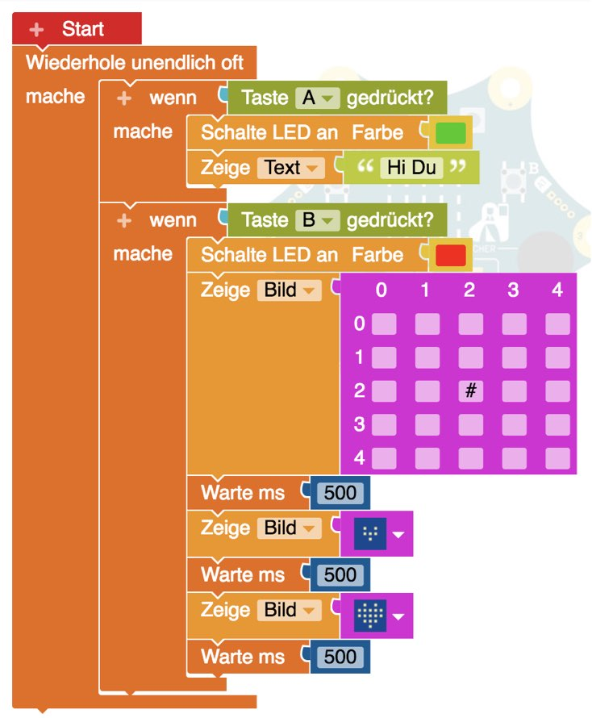

# Erste Schritten mit dem Calliope

- Auspacken
- Teile erklären
- Batteriefach füllen und anstecken
- Anschalten
- Demo ausprobieren
- Vorinstallierte Programme/Spiele vom kleinen Heftchen ausprobieren
- Menü kann manchmal etwas tricky sein: 
- beide Tasten A+B gleichzeitig drücken für Menü (1..4), dann "B" für hochzählen, "A" für runter
- Schütteln für Start des Spiels

1. Orakel: Frage stellen, Taste "A" drücken für Antwort
2. Schere-Stein-Papier-Brunnen: Mit 2. Spielpartner, Gleichzeitig **schütteln** für Anzeige
3. Zusammenpassen: Fasse Pin 0 an, Partner fasst Pin 3 an, Anzeige wie gut ihr "zusammenpasst"
4. LED Snake, mit Tasten "A" nach Links und "B" nach Rechts lenken und Futter fressen lassen

## Texte, Bilder und Farben anzeigen

Ihr kennt jetzt schon die Tasten und das Anzeigefeld.
Unter dem ist noch eine Farblampe (LED) die alle Regenbogenfarben anzeigen kann.

Zum Ausprobieren kann man direkt nach dem Start eine Aktion starten um zu sehen was sie macht.

Es ist auch prima am Simulator am Computer zu testen, dann weiss man schonmal dass es funktionieren sollte.

OpenRoberta: "Sim"-Feld klicken und mit dem kleinen Play-Dreieck (rechts!) starten

MakeCode: Simulator ist links, wenn Du ihn nicht sehen kannst, dann mit dem kleinen Dreieck unten links anzeigen lassen
Bei Make Code gibt es "beim Start" und "dauerhaft" als Anfangsaktionen.

Bei beiden gibt es Aktionen, Kontrolle, Sensoren, Variablen/Platzhalter links im Menü.
Einfach mal durchgucken was es da alles gibt, dann findet man sich auch später zurecht.
Bei MakeCode kann man auch im Feld darüber ein Stichwort wie "led" eingeben.

Das wollen wir jetzt mal testen

Erklärungen:

- `wenn bedingung dann aktion` - Bedingung ist: `Taste A` gedrückt
- LED Farbe Anzeigen
- Bilder Anzeigen, entweder aus Liste oder selbsgemacht
- Text Ausgabe
- Alles in einer Dauerschleife laufen lassen, sonst macht die Calliope es nur einmal

Wenn Taste "A" gedrückt:

1. LED grün
2. Anzeige Text, zum Beispiel "Hallo Du" und LED grün

Wenn Taste "B" gedrückt: 

1. LED rot 
2. Anzeige Bilder, zum Beispiel ein größer werdendes Herz  mit Pause

MakeCode

OpenRoberta:

