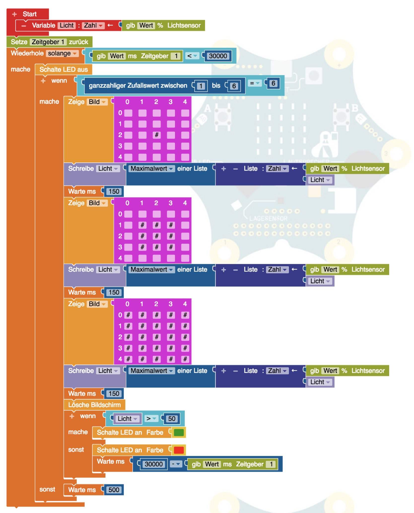

# Lichter fangen

Das ist eine Variation von "Whac-A-Mole" bei uns aber weniger brutal mit vielen Calliopes.

Die Idee ist, dass die Calliope auf dem Tisch verteilt liegen und zufällig aufleuchten und man sie dann innerhalb einer halben Sekunde anleuchten muss.
Falls man es nicht schafft, wird die Calliope rot und schaltet sich ab.
Das ganze Spiel geht für 30 Sekunden.

Da das alles gleichzeitig passiert, hat man ganzschön zu tun, die schnell genug anzuleuchten.

Zum Schluss darf sich jeder einmal versuchen.

Zusatzmaterial: Taschenlampe

Erklärung:

- Variable für Lichtsensor
- Wir messen vorher aus wieviel der Unterschied zwischen Raumhelligkeit und Taschenlampe ist
- Größerer von 2 Werten (Maximum) geht be OpenRoberta nur mit einer Liste von Zahlen (also beliebig vielen)
- "Zeitmesser 1" für Gesamtspieldauer starten
- "Wiederhole solange <Bedingung>" Schleife läuft solange "Bedingung" erfüllt
- In unserem Fall ist die Bedingung "Zeitgeber" < 30 000 Millisekunden (30 Sekunden)
- Wenn man versagt hat, schaltet die LED auf rot und es wird die "Restzeit" (30000 minus Zeitgeber) gewartet.

Ablauf:

- Lichtsensor auslesen und in Variable schreiben
- Wir messen mehrmals innerhalb der halben Sekunde (aller 150 Millisekunden)
- Das angezeigte Bild wird immer voller, um den Ablauf anzuzeigen
- Wenn der neu gemessene Wert größer ist behalten wir den (Maximum von Liste)
- Nach der letzten Messung Vergleich 
- Falls schnell genug geleuchtet wurde, wird die LED grün sonst rot und Stop

