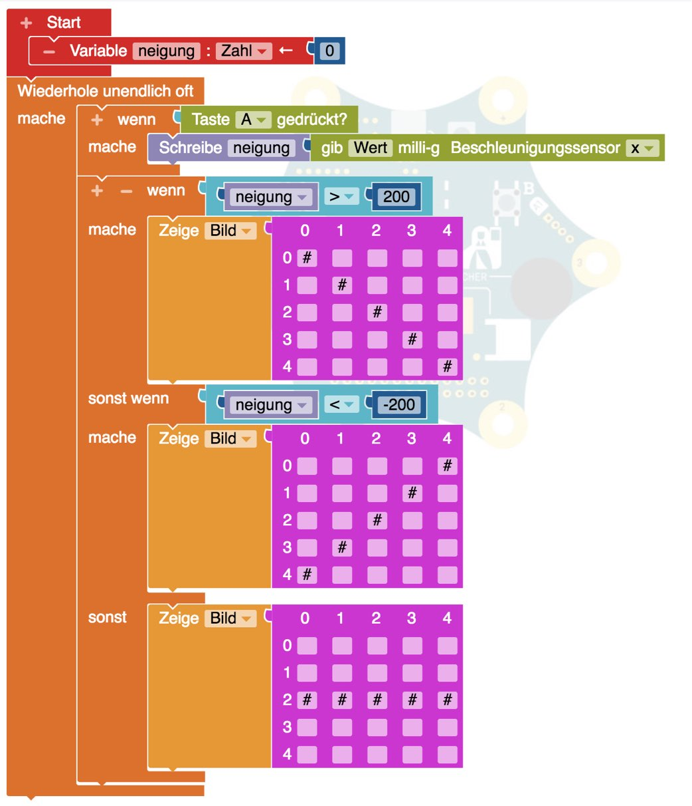

# Wasserwaage

Wir wollten die Neigung der Calliope messen und anzeigen ob sie gerade oder schief liegt.

Dazu brauchen wir einen neuen Beschleunigungs"Sensor", der die Neigung in X- oder Y-Richtung messen kann in (Tausendstel Gravitation)

Wir schreiben den Wert in eine Variable "neigung", wenn die Taste "A" gedrückt wird.

Zum Testen können wir den Wert einfach ausgeben und sehen, wo es wechselt.

Dann vergleichen wir einfach wie auf einem Zahlenstrahl, wenn "neigung":

1. kleiner als -200 ist, dann ist es nach links geneigt.
2. größer als 200 ist, dann ist es nach rechts geneigt
3. ansonsten (zwischen -200 und 200) ist es gerade

und zeigen dann das entsprechende Bild.

