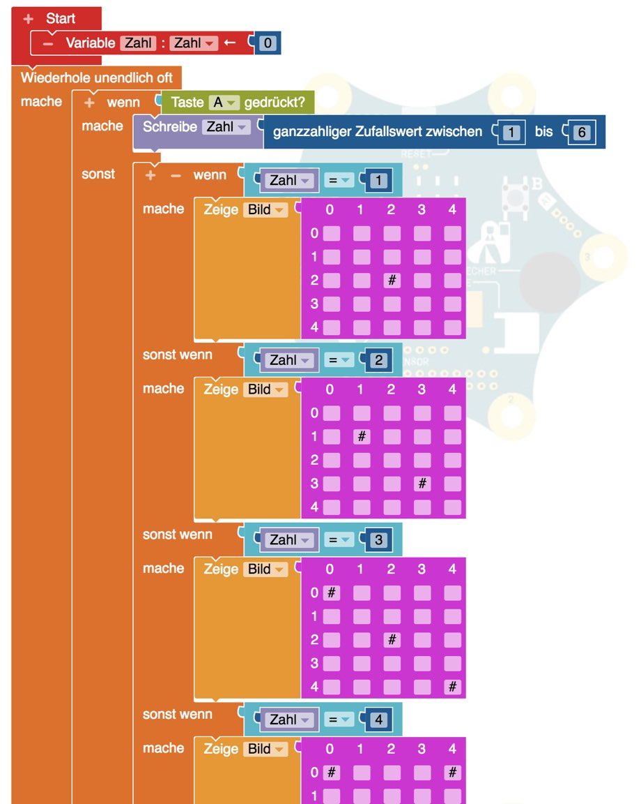

# Würfel

Ein Würfel ist ganz einfach, nur etwas Klickerei.

1. Nach einer Aktion (Schütteln oder Taste drücken)
2. Wird eine Zufallszahl (1..6) ermittelt und in einer Variablen (Platzhalter gespeichert)
3. Und dann entweder nur die Zahl angezeigt (einfach)
4. Oder das entsprechende Würfelbild mittels "wenn ... dann ..." angezeigt

Erklärungen:

- Zufallszahlen
- Variablen/Platzalter (benannte Plätze im Computer für Werte, z.B. Zahlen oder Texte)
- `Wenn Bedingung Dann Aktion` wenn eine Bedingung wahr ist, dann mache die Aktion
- Bedingung ist in unserem Fall ein einfacher Vergleich von einer Zahl mit unserer Variable auf Gleichheit

